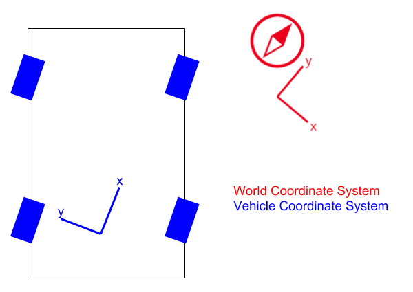
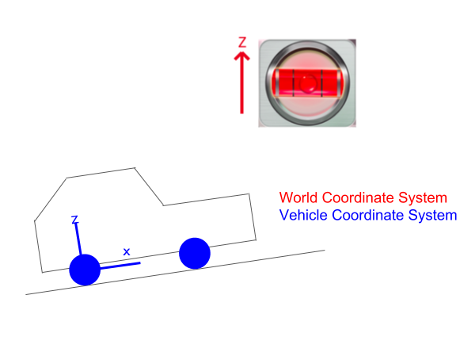

# homework6

In this homework, you will start to write your own self-driving vehicle agent by implementing a simple planning and control algorithm. You will control the vehicle agent to run in a simulation environment simplified from the final project. Are you feeling excited?  


## Background

Before starting to finish homework tasks, you should understand the definition of coordinate systems, the definition of the vehicle parameters in our homework, the way we measure the status of the vehicle and the control model of the vehicles. 

### 1. Coordinate Systems

In the homework, we have two coordinate systems defined. Here is the detail: 




#### World Coordinate System
World Coordinate System is the ground coordinate system. 
* x: east
* y: north
* z: up

#### Vehicle Coordinate System
##### Easy Version
* origin: middle of rear axle
* x: front
* y: left
* z: up
##### Full Version
Vehicle Coordinate System is a Cartesian coordinate system in meters. The origin is the midpoint of the centers of the two rear wheels. The z-axis is perpendicular to the ground. The x-axis is the direction of the velocity of the middle of the rear axle when driving.

#### Yaw-Pitch-Roll
It's not recommended to use yaw, pitch, or roll in our project. Because, [the standard yaw axis](https://en.wikipedia.org/wiki/Aircraft_principal_axes) is opposite to our z-axis in Vehicle Coordinate System, and the standard pitch axis is opposite to our y-axis in Vehicle Coordinate System. It's confusing and easy to introduce bugs when using yaw, pitch, or roll. To perform orientation and rotation computations, the unit quaternion is recommended. To debug or visualize an orientation or rotation, please consider using axis–angle and rotation vector. If you really want to use yaw, pitch, and roll, make sure you understand the direction of the rotations.

### 2. Vehicle Status

`common/proto/vehicle_status.proto` defines the status of a vehicle agent, including position, velocity, acceleration, etc. In the real world, these data is usually collected from sensors, such as GPS and IMU. In the homework, the vehicle status is computed based on the vehicle's control command with a dynamic model. Your vehicle agent will get the status with some random noise introduced to simulate the imprecise sensor data in reality. 

### 3. Vehicle Params

`common/proto/vehicle_params.proto` defines how we model a vehicle. It's quite important to understand the position of the axles in a vehicle to when performing a turn. The parameters in our homework could be found in `common/data/vehicle_params/vehicle_params.txt`. 

### 4. Control Command

`common/proto/control.proto` defines how you will control your vehicle agent. Roughly speaking, you will control the steering wheel, throttle pedal and the brake pedal, which are the most important three elements in a vehicle. You don't need to consider other elements in a real vehicle, such as turn signal, gear, etc. 

## Homework

### 1. Get familiar with the simulation environment. 

Same with last homework, the first step in this homework is to get familiar with the environment. To give you a first glance of the simulation system, you could run following command:

```
bazel run -c opt //homework6:simulation_main -- --route_file_path {PATH_TO_CODEBASE}/homework6/data/routes/simulation_config_1.txt 
```


You could see a vehicle running in a straight lane slowly in the simulation system. The red flag represents the destination of the route. When the car reached the destination, the red flag will disappear. A dock widget in the right-side of the main window shows the status of the running vehicle. 

Besides, you could press following keys on keyboard to try some UI actions:

1. `SPACE`: Pause the simulation. 
2. `+`: Speed up the simulation. 
3. `-`: Slow down the simulation. 
4. `RIGHT ARROW`: Run next iteration (only available when simulation is paused). 

The source code of the sample vehicle agent is placed at `homework6/agents/sample/sample_agent.h`. The logic of it is quite simple. You could easily understand it by reading the source code. 

The class `SampleVehicleAgent` inherits base class `VehicleAgent`. You could find the source code of the base class at `homework6/simulation/vehicle_agent.h`. When you implement your own vehicle agent, you need to write a class which also inherits from it. 

Your derived class needs to implement two main virtual functions in the base class `VehicleAgent`. 

1. `void Initialize(const AgentStatus& agent_status);` The function will be called once with a initial status of the vehicle agent after your vehicle agent is constructed. 
2. `ControlCommand RunOneIteration(const AgentStatus& agent_status)` The function will be called every 0.01 seconds in simulation time. Your vehicle need to generate a control command based on your vehicle's current status passed in the function parameter. 

The `AgentStatus` is the proto object that represents the complete status that an agent needs to know. The definition of it could be found at `common/proto/agent_status.proto`. It contains the simulation status, the vehicle status and the route status .

The `SampleVehicleAgent` is registered into an agent factory in `homework6/agents/agents.cc` with a static variable. When you implement your own agent, you also need to register the class in this file with your agent's type name. 

The config file `homework6/data/routes/simulation_config_1.txt` defines the simulation task which the agent needs to finish. It contains the agent's type name, instance name (could be any string) and the `start_point`/`end_point` of the route. The agent starts from the start_point, and needs to reach the destination in static state. When you start to run simulation with your own agent, you need to change the agent_type to your own agent's type name, the same as the registered name in `homework6/agents/agents.cc`. The criteria of 

### 2. Control your vehicle in a straight lane. 

Now it's time for you to start write your own self-driving vehicle agent. Let's start from a simple task, drive your car in a straight lane with uniform linear motion and uniform acceleration linear motion. 

**Your task**: Implement your own vehicle agent which can finish the route in straight lane specified in `homework6/data/routes/simulation_config_1.txt`. The vehicle should be accelerated to `5m/s` with uniform acceleration linear motion, and keeps running with velocity `5m/s` to a point near the destination, and smoothly brake to a static status.

At first step, you need to understand how throttle and brake ratio in the control command will affect your vehicle's velocity. You could test it by trying different throttle or brake ratios in the simulation. Note that the acceleration triggered by a control command is not only determined by the ratio, but also might be determined by vehicle's current status. You may need to generate a table, which lists expected acceleration of different throttle/brake ratio with different vehicle status. Also note that the vehicle status passed into `RunOneIteration()` is not perfect. Some random noise has been introduced. 

When the table is ready, you could plan your vehicle's motion based on the table. Then you need to implement a control algorithm to control your vehicle as planned. One choice could be using PID algorithm. 

Note that generating the table above is a recommended step, but if you can finish the task perfectly without generating the table, it's fine to skip this step. 

### 3. Control your vehicle to finish a route that contains turns

Your vehicle should be able to run in the straight lane now. It's time to drive it in a corner. 

**Your task**: Add lateral planning and control algorithms to make your vehicle able to finish a route that contains turns with uniform velocity `5m/s`. Your vehicle should finish the routes specified in `simulation_config_2.txt` and `simulation_config_3.txt`. You could reuse your code for homework6 to generate the path from the start point to the end point. 

One choice of algorithms might be using bicycle model to plan the motion, and using PID to correct the difference between actual motion and planned motion. You are free to choose other algorithms than bicycle model and PID. You could find some of algorithms in the lecture slides. 

**What to submit**: 
1. The table which lists the expected acceleration of different throttle/brake ratios and vehicle's status. You are free to choose ratio's sample rate, and any properties in vehicle status if necessary. 
2. The document with necessary source code to explain how you generate the table. **If your algorithm does not require this table, there is no need to submit the table and the document.**
3. The source code of your vehicle agent and a brief document to explain the algorithms you implemented. 
4. The videos recorded from the screen which contain the complete trips of how your vehicle finishes `homework6/data/routes/simulation_config_x.config`. 
5. The line charts of the vehicle's velocity in each trip. 

## Implementation Convention

In the final project, the vehicle agent implemented by you will be running in a same environment together with other agents. To avoid potential symbol conflict, we need to make following convention. All of your code should be placed in a namespace named by a unique id, such as github id. All of gflags names should be started with `{unique_id}_`. All of the source code files should be placed at directory `homework6/agents/{unique_id}`.  For example, if one's id is `xuan_pony`, all of his code should be placed in the namespace `xuan_pony`. And all of the gflags he defined should be started with `xuan_pony_`. All of the source code files should be placed at the directory `homework6/agents/xuan_pony/`. 
